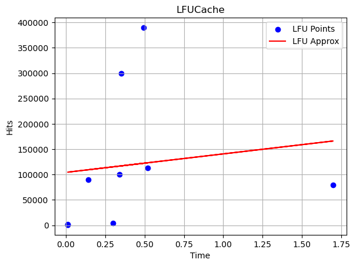
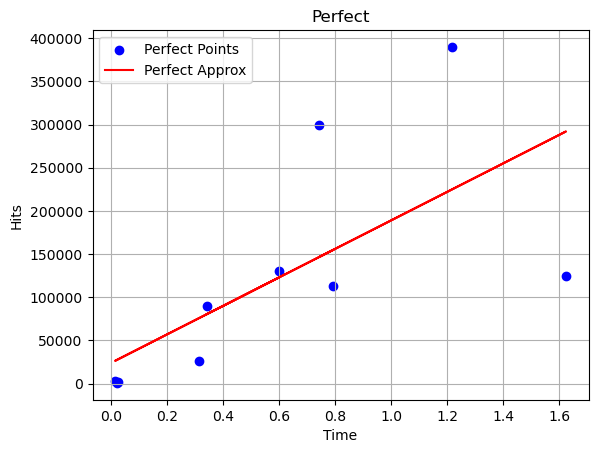
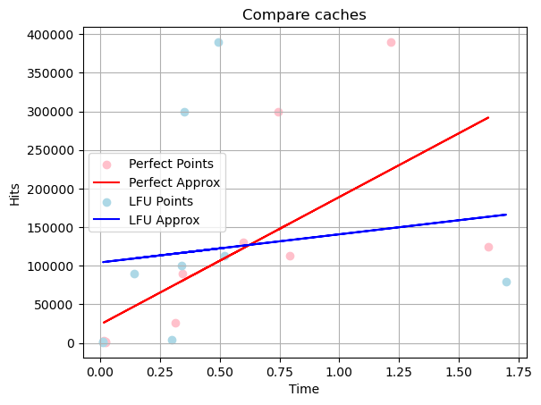

# LFU кэш
### Дисклеймер
Всем привет!
Данный проект выполнен в учебных целях в рамках курса по C++. 

Целью данного проекта является написание LFU(least frequently used) и идеального кэша.

## Компиляция
```
cd LFUCache/
cmake -S ./ -B build/
cmake --build build
cd build/
```
Для запуска проекта требуется:

```
./lfu < path_to_test_file
./perfect < path_to_test_file
./cache_test
```

Опционально можно изменить формат вывода. В новом формате будет помимо попаданий, будет выведено время работы кэша.

```
./lfu DEBUG < path_to_test_file
./perfect DEBUG < path_to_test_file
```

## Ввод/вывод
На вход программа принимает m - размер кэша, n - количество страниц, передаваемых на вход и сами страницы.

На выходе мы получим количества попаданий и времена работы для обоих кэшей.

## Сравнение кэшей
Сравнение и измерение эффективности кэша довольно противоречивый вопрос, поэтому постараемся посмотреть на этот вопрос с более простой стороны. 

Построим и сравним графики количества попаданий от времени работы. Данные графики не до конца позволяет нам досконально изучить этот вопрос, потому что данных не так много, при одинаковом количестве попаданий, время работы кэша может существенно различаться.







Сравнивая эти 2 графика, можем заметить, что на большом количестве данных при одинаковом количестве попаданий, идеальный кэш будет работать быстрее, чем LFU. Это может быть вызвано по нескольким причинам. Во-первых, при одинаковых входных данных, идеальный кэш дает выдает больше попаданий, чем LFU. С другой стороны, это может быть вызвано, тем, что идеальный кэш был реализован более эффективным алгоритмом, чем LFU.